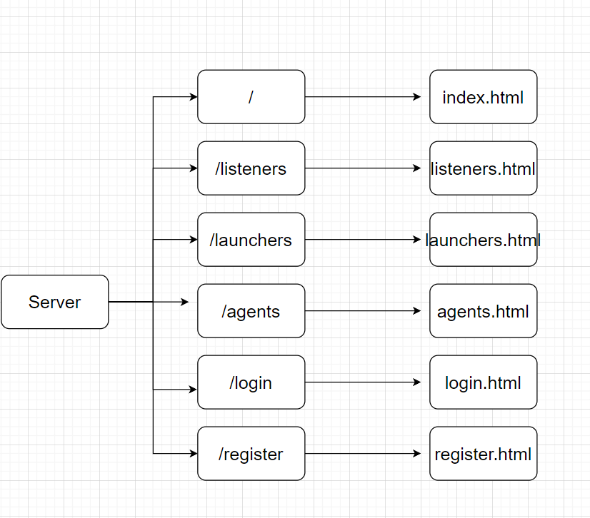
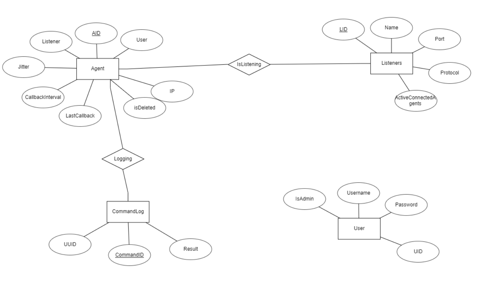

# MedellinC2
_____ ______   _______   ________  _______   ___       ___       ___  ________           ________   _______     
|\   _ \  _   \|\  ___ \ |\   ___ \|\  ___ \ |\  \     |\  \     |\  \|\   ___  \        |\   ____\ /  ___  \    
\ \  \\\__\ \  \ \   __/|\ \  \_|\ \ \   __/|\ \  \    \ \  \    \ \  \ \  \\ \  \       \ \  \___|/__/|_/  /|   
 \ \  \\|__| \  \ \  \_|/_\ \  \ \\ \ \  \_|/_\ \  \    \ \  \    \ \  \ \  \\ \  \       \ \  \   |__|//  / /   
  \ \  \    \ \  \ \  \_|\ \ \  \_\\ \ \  \_|\ \ \  \____\ \  \____\ \  \ \  \\ \  \       \ \  \____  /  /_/__  
   \ \__\    \ \__\ \_______\ \_______\ \_______\ \_______\ \_______\ \__\ \__\\ \__\       \ \_______\\________\
    \|__|     \|__|\|_______|\|_______|\|_______|\|_______|\|_______|\|__|\|__| \|__|        \|_______|\|_______|

Welcome to Medellin C2! The development of this C2 is being used to enhance my coding knowledge, and learn more about red teaming. This C2 will work with windows and linux agents. 

### Current Features
- Create Listeners, even with the server running it will automatically notice a new listener has been made 
- Accept multiple connections to a single port/multiple ports simotaneously 
- Create a PowerShell launcher (payload)

### Structure
```
cmd
   | 
    create.go
    init.go
    list.go
    listeners.go
    root.go
    server.go
    start.go
data
   | 
    data.go
launchers
    | 
    (Contains auto-generated launchers)
MedellinC2 (executable)
```




### Commands
- `./MedellinC2 init`: Initializes the databases 
- `./MedellinC2 listeners`: Displays the listeners menu
- `./MedellinC2 listeners create`: Create a new listener
- `./MedellinC2 server`: Displays the server menu
- `./MedellinC2 server start`: Starts the C2 server, which allows listeners to listen for connections from agents
- `./Medellinc2 launcher`: Displays the launchers menu
- `./MedellinC2 launcher windows`: Create a windows launcher (payload)
- `./MedellinC2 launcher linux`: Creates a linux launcher (payload)

### Future
- Create agents workflow to execute commands on remote machines 
- Add in modules (tasks) to run on agents 
- Make the CLI look nicer and more user friendly 
- Add encryption to communication channels 
- Optimize performance 